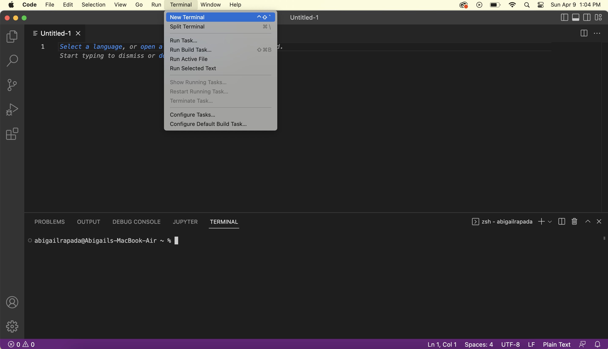

# Lab Report 1
## How to Login to Course-Specific Account
Click on this link to access your [course-specific account](https://sdacs.ucsd.edu/~icc/index.php).
You should be directed to this page.

Input your student username that is from your UCSD email, for example, *arapada* is the username from *arapada*@ucsd.edu.
Along with your student ID.

After that, you should be directed to this page below

Under **Addtional Accounts**, there should be a course-specific account that has the course name, number and term. For example, *cs15lsp23*.
You should be able to reset your password for that account teehee. **DON'T RESET YOUR ACTIVE DIRECTORY PASSWORD unless you actually forgot!!!**

## Installing VSCode
Click on this link to download [VSCode](https://code.visualstudio.com/). Make sure to download for Mac or Windows depending on OS. 

Then, click on the zip file in order to access the application. You should be able to double-click on the application to open it.

You should have the application open and look something like this. VSCode doesn't have to look exactly like this but something similar as seen below.

## Remotely Connecting
Connecting remotely to your course-specific account requires your terminal. You can access your terminal through VSCode or your built-in terminal on your device. 

To access your Terminal on VSCode, make sure to be on a new file (it can be any type of file) then click on Terminal -> New Terminal. This will pop out a new terminal that is shown to be connected to your User device.

