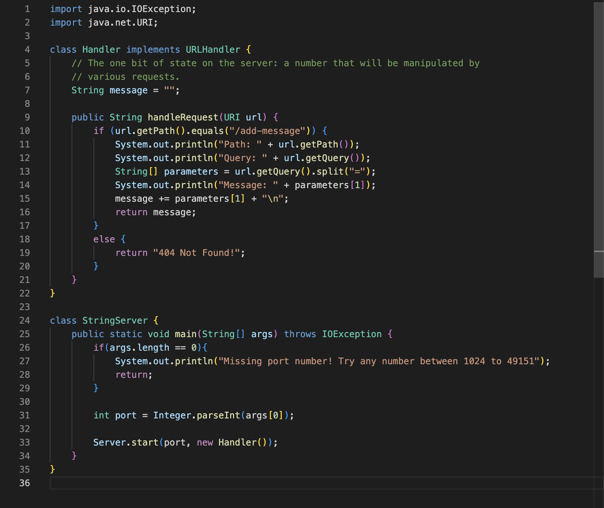

# Lab Report 2
## Servers
The Code:

The Website URL:

The methods called in the first screenshot are handleRequest() and main(). The handleRequest() method accesses the URL then implementing the URLHandler interface in order to use the method, the parameter is the URL which is used to display a message on the web server depending on the query if it aligns with the if statement. Then, in order for the code to compile, when there is user input in the URL, the main() method starts running the server which takes in the parameter of a port number.

The handleRequests() accesses the URL, localhost:4000/add-message?s=boom. The method uses the path in order to access the message which includes spliting the long string of the URL in order to access small bits like "boom" as the intended message. Then, that message that was String.split() method can be easily accessed and added to the variable String message in order to store that message, which gets returned and displayed on the web page. I used System.out.println() lines in order to make sure the path, query and message are correct. 

This specific request changes the value of `String message` by concatenating the message from the URL and adds that message into the exist `String message`, storing the previous message on the web page. Only path and query stay the same because they are used to be able to do the action of adding the message onto the page. 

