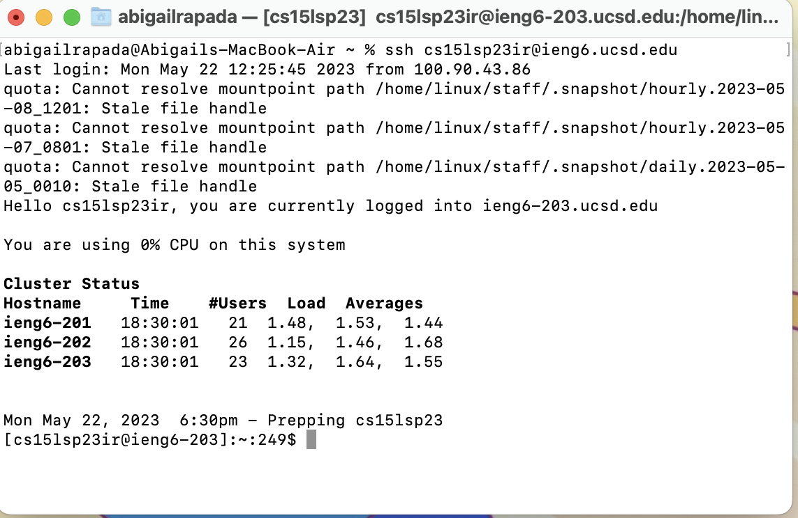
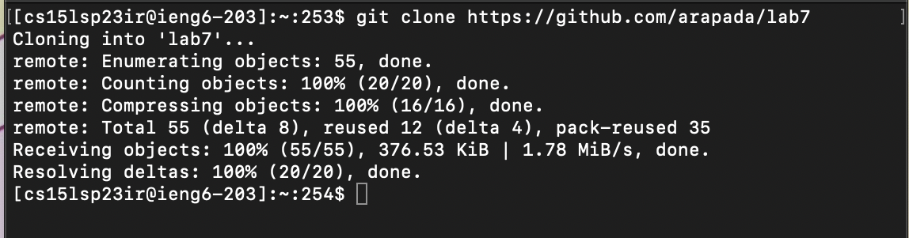
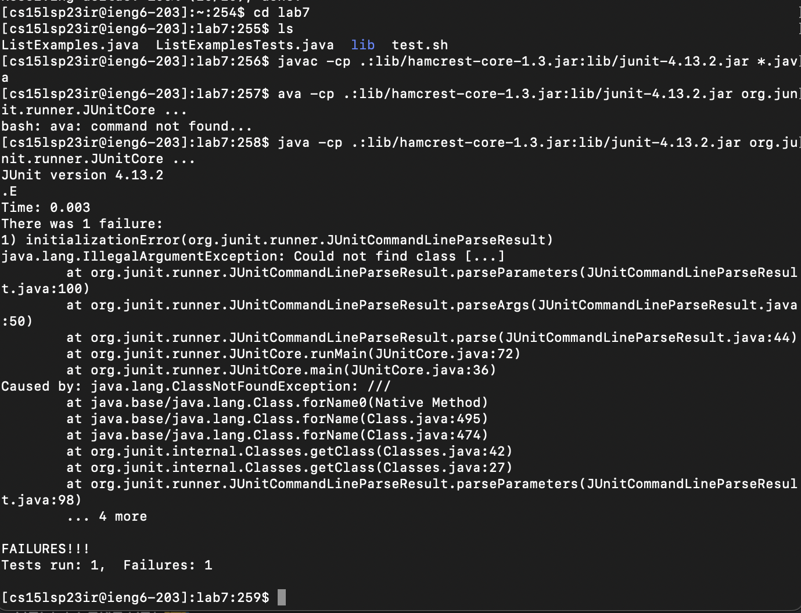
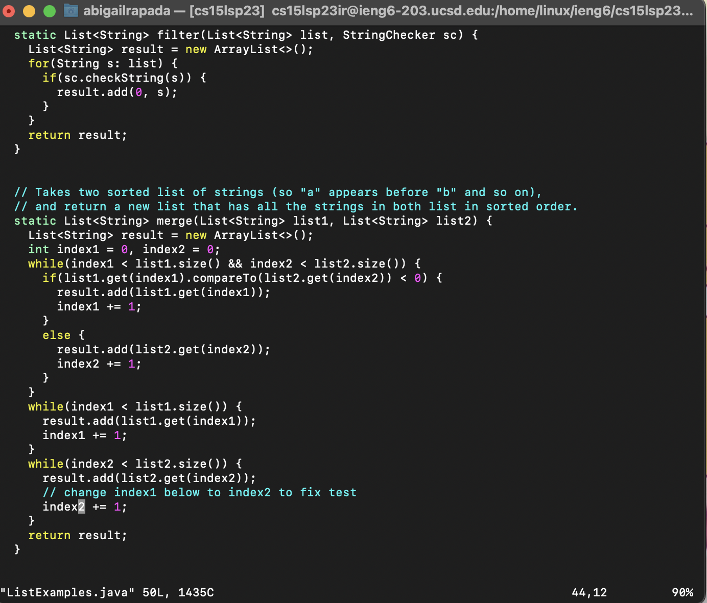
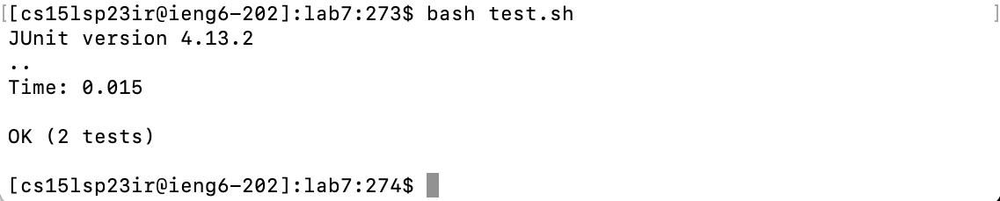

# Lab Report 4
## Baseline
Step 4: Log into ieng6

On the terminal, I typed `ssh cs15lsp23ir@ieng6.ucsd.edu <enter>`. This allows me to access my account while also not having to input the password to save time.

***

Step 5: Clone your fork of the repository from your Github account

On the terminal, I typed `git clone https://github.com/arapada/lab7 <enter>`. WHich clones the repository under the account *arapada* .

***

Step 6: Run the tests, demonstrating that they fail

On the terminal, I typed `cd lab7` *that was the name of the directory from the repository that I have cloned from my github account.* ` <command> + <c>` to copy and paste the junit test command for java, which is `<ctrl> + <v> javac -cp .:lib/hamcrest-core-1.3.jar:lib/junit-4.13.2.jar *.java <enter>`. `<command> + <c>` again to copy and paste the run command for java. `<ctrl> + 
ava -cp .:lib/hamcrest-core-1.3.jar:lib/junit-4.13.2.jar org.junit.runner.JUnitCore ...` but I messed up because i forgot to include the `j` in `java` so i tried again... `j <command> + <c>ava -cp .:lib/hamcrest-core-1.3.jar:lib/junit-4.13.2.jar org.junit.runner.JUnitCore ...`. *Should demonstrate the tests failed.*

***

Step 7: Edit the code to fix the failing test

On the terminal, in order to edit the file, I typed `vim ListExamples.java<enter>` which opens up vim. Then, I typed `/index1<enter> n n n n n n n n n n l l l l l r 2 <esc> :wq` *I searched for index1 because that was the only part where I needed to edit, then pressed `n` many times to get to the exact spot, replaced the 1 to 2, then saved and quit.*

***

Step 8: Run the tests, demonstrating that they now succeed.

After exiting `vim`, on the terminal, i did `bash test.sh<enter>` *to test the edit I made on ListExamples.java file, which should run the tests successfully.*

***

Step 9: Commit and push the resulting change to yoru github account(you can pick any commit message!)

image 

On the terminal, I did
