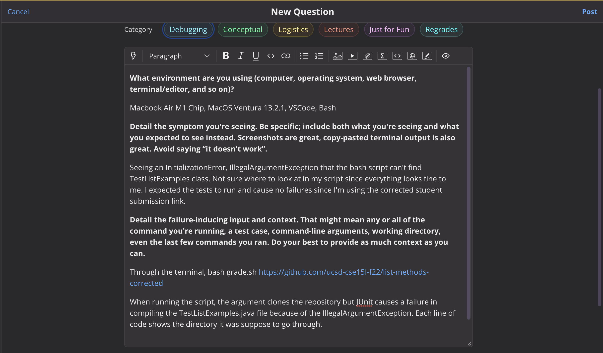
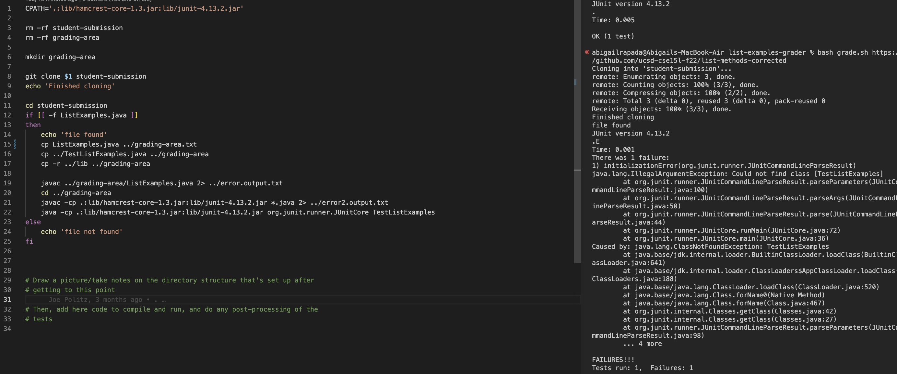
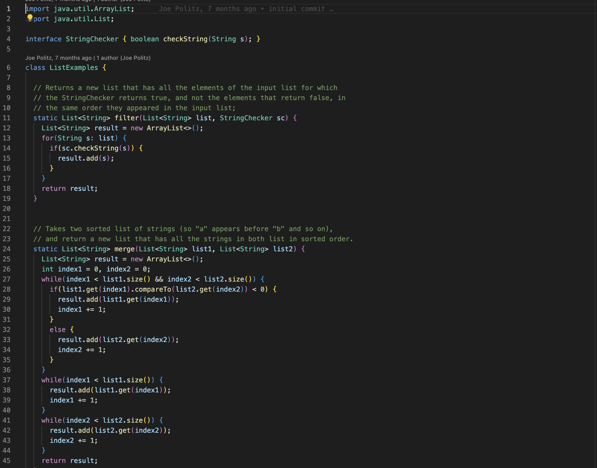

# Lab Report 5
## Part 1 - Debugging Scenario

TA message: Have you exactly checked your directory when copying the path from the "student" submission? What are the ways in order to copy the submission and run their .java file through the tester files? Try `cp ListExamples.java ../grading-area`

The error is in line 15, where it says `cp ListExamples.java ../grading-area.txt` which causes the error of JUnit having trouble finding the ListExamples.java, thats the student submission through autograder, when the directory is trying to copy down a NON-existing directoy of a grading-area text file.

The file/directory should copy the path from the student submission into the grading-area directory when going through the grade.sh script. The file should be copied to list-examples-grader/grading-area in order for the file to be tested through JUnit. In the ListExamples.java file, this file should be the corrected version in order to simulate the repository as a student submission for it to pass the grade script. grade.sh clones the student repository into grading-area directory, then run through ListExamplesTest.java file using JUnit tests in order to compile and run.

To trigger the bug, in the terminal, I typed `bash grade.sh https://github.com/ucsd-cse15l-f22/list-methods-corrected <enter>` in order to run the repository, then test it out. 

To fix the bug, in line 15 of grade.sh bash script, we must delete `.txt` that is next to /grading-area in order for the work to clone, compile, run and output the correct output that the student wanted as seen from the first screenshot. 

## Part 2 - Reflection
